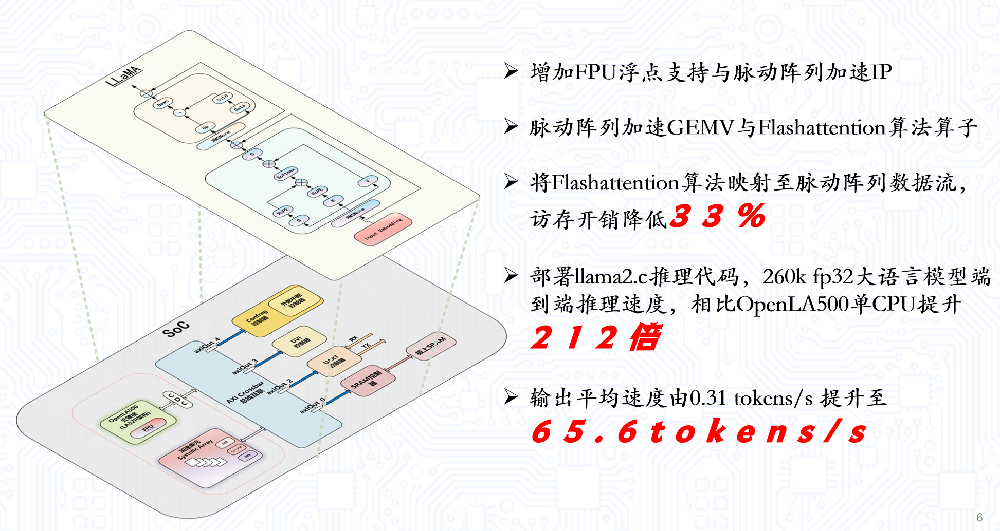
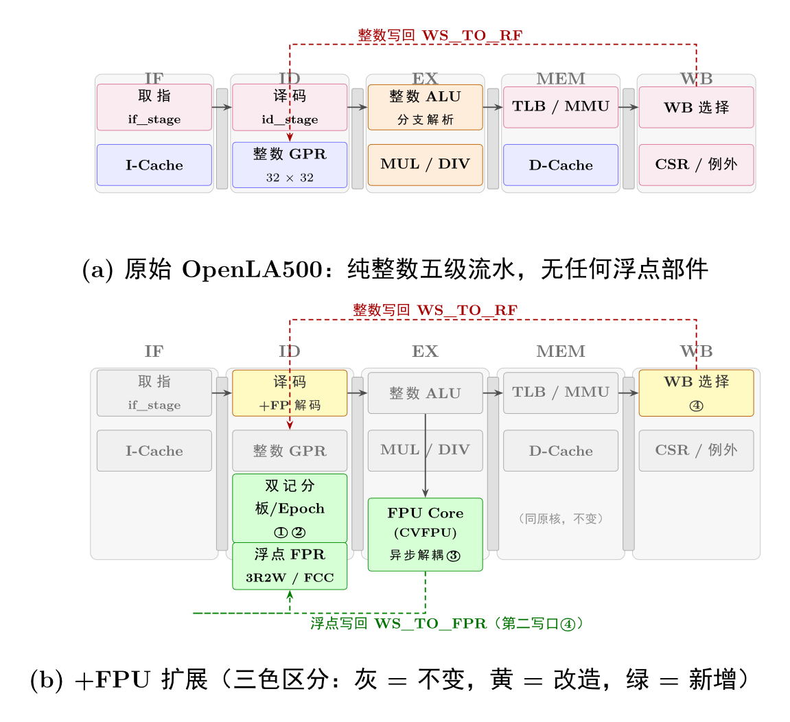
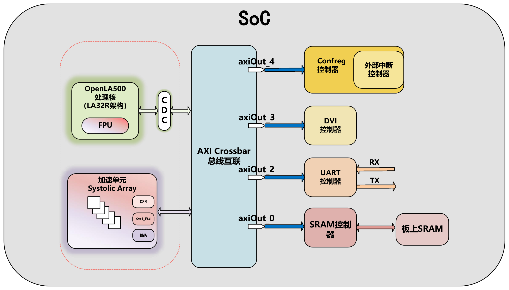

# GEMV-FSA：支持 FlashAttention 的推理加速 SoC

面向边缘端 LLM 推理的双模式脉动阵列加速器：同一套 32-PE 阵列，用输出驻留（OS）数据流加速
线性层 GEMV，用权重驻留（WS）+ FlashAttention-2 在线 softmax 加速注意力。配合 CPU 侧浮点
扩展与 64 位总线，在无硬件浮点的国产标量处理器上跑通 llama2.c 端到端推理。

本仓库是 **2026 年第十届全国大学生集成电路创新创业大赛（集创赛）龙芯中科杯总决赛**参赛作品
《支持 FlashAttention 的推理加速 SoC 设计》的前端设计部分开源发布。

| 项目 | 内容 |
|---|---|
| 赛事 | 2026 年第十届全国大学生集成电路创新创业大赛（集创赛） |
| 赛题 | 龙芯中科杯 |
| 阶段 | 总决赛 |
| 队伍编号 | **CICC1001054** |
| 作品名称 | 支持 FlashAttention 的推理加速 SoC 设计 |
| 奖项 | **华东赛区一等奖**、**全国二等奖** |



> **图 1** 系统总览：上半为目标模型 LLaMA 的单层结构，下半为完整 SoC——OpenLA500 处理核
> （含新增 FPU）与脉动阵列加速单元经 AXI Crossbar 与各外设互联。

## 核心成果

在 llama2.c / stories260K、256-token 序列上实测（完整 SoC 端到端口径，覆盖 GEMV、FSA 与 CPU 调度）：

| 指标 | 结果 |
|---|---|
| **端到端推理** | **210×** 加速（107,535,372 → 511,431 cycles/token） |
| **精度** | greedy 解码与纯 CPU **逐 token 一致**；端到端 FlashAttention MRE 0.0985% |
| **功能验证** | UVM 约 590 个测试点全 PASS；功能覆盖率 95.19%、Line 91.08% |
| **可综合可上板** | DC（Nangate45）200 MHz 时序收敛；FPGA `xc7a200t` 已上板跑通，整机 LUT 110,770（82.30%） |

210× 由两级叠加而来：**双模式加速器本身 27.6×**（107.5M → 3.90M cycles/token），
再叠加 **CPU 侧 FPU 等优化 7.6×**（3.90M → 0.51M）。

## 设计要点

### 1. 一套阵列覆盖两类算子

自回归解码阶段每层内有两类算子，都是访存密集：线性层因每步只有单个 token 向量而退化为 **GEMV**，
注意力则要读完整 KV cache 且 softmax 归约使访存随序列长度呈 $O(N^2)$ 增长。二者数据复用方式相反，
故分别选型：GEMV 权重算完即弃 → **输出驻留（OS）**；注意力先在算法层引入
**FlashAttention-2 在线 softmax** 把访存降至 $O(N)$，再由其流式特性推出需要“流出—变换—流回”通路
→ **权重驻留（WS）**。两者共用同一套 32-PE 阵列，省去为两类算子各做一套的开销。


> **图 2** FSA 数据流的四个阶段：① K 流入、Q 驻留算 QKᵀ 上行累加 → ② CMP 求行最大值 M₀ →
> ③ 减最大值后经 slope/intercept 查表做 exp2 分段线性近似得到 P → ④ P 与 V 相乘下行累加出 O。

### 2. 可重构分组适配不同头维度

32 可被 8/16/32 整除，因此能无浪费地重构为 **4×8 / 2×16 / 1×32** 三种分组，覆盖 `head_dim`
从 8 到 64 的配置。分组变大时由多段 PE 串联成更长的脉动链。


> **图 3** 可重构分组：4×8（4 头并行，每头 8 PE）/ 2×16 / 1×32，灰色 CMP 表示该段比较单元在本模式下不使能。

### 3. CPU 硬件浮点扩展

原 OpenLA500 是纯整数五级流水、无任何浮点部件，RMSNorm/RoPE/SiLU 全靠软浮点模拟。扩展方案：
ID 级增加 FP 解码与浮点寄存器堆（3R2W / FCC）、EX 级挂 CVFPU 并异步解耦、WB 增开第二写口回写浮点。
这一项贡献了整体加速中的 7.6×。



> **图 4** FPU 扩展前后对比：(a) 原始 OpenLA500 纯整数五级流水；(b) +FPU 扩展，
> 灰 = 不变、黄 = 改造、绿 = 新增。

### 4. SoC 总线加宽至 64 位

算子卸载到加速器后，瓶颈从算力转移到数据搬运（`GEMV.hw` 中约 87% 的时间是纯搬运）。开发板上两片
各 32 位的异步 SRAM 原本由 `addr[22]` 二选一、同一拍总有一片闲置，改为并联出 64 位后单次访问字节数
翻倍，而异步 SRAM 的访问时序不变。互连同步换成 pulp-platform 的参数化 `axi_xbar`，CPU 侧插一级
`axi_dw_converter` 升宽。**cycles/token 再降 13.7%**，代价是 +3,639 LUT。



> **图 5** SoC 架构：OpenLA500（含 FPU）与加速单元经 AXI Crossbar 挂接 Confreg / DVI / UART /
> SRAM 控制器等外设。


> **图 6** 加速器顶层：CSR/DMA 调度 + 32-PE 脉动阵列 + Input/Vector/ACC/Output 四级片上 SRAM。
> CPU 通过 CSR 配置一次 job 并启动，顶层状态机驱动 DMA 搬数、触发计算、写回结果，全程不介入数据搬运。

> 更完整的架构论证、精度实验与综合数据见 [`docs/spec/`](docs/spec/) 与
> [`uvm/docs/`](uvm/docs/)；ASIC 后端物理实现不在本仓库开源范围内。

## 目录结构

```
gemv_fsa/
├── rtl/                          # 加速器 RTL 源代码
│   ├── CB_top_v2.sv              # 顶层模块
│   ├── cb_controll_v2.sv         # 控制器（CSR + GEMV/FSA 双模式 DMA 调度 + 预取 FSM）
│   ├── mac_top_v2.sv             # MAC 引擎顶层（PE 阵列 + FSA 数据通路）
│   ├── PE_core_v2.sv             # 32-PE 阵列（OS/WS 双模式）
│   ├── axi_dma_controller.sv     # AXI4 DMA 控制器（多笔 outstanding）
│   ├── PE/                       # PE 单元（Chisel 生成后手工重定时）
│   ├── fsa/                      # FlashAttention 专用模块
│   │   ├── fsa_ctrl_fsm.sv       # FSA 控制 FSM
│   │   ├── fsa_transposer.sv     # K 矩阵转置引擎
│   │   ├── fsa_accumulator.sv    # 在线 softmax 累加器
│   │   ├── FPAccUnit_pipe.sv     # 含 exp2 8 段 PWL（Chebyshev 系数）
│   │   └── silu_ctrl_fsm.sv      # SiLU 激活融合控制
│   └── fsa_gen/chisel_fsa_fp32/  # Chisel 生成的 FP 运算单元（CMP/比较器等）
│
├── tb/                           # Directed Testbench
│   ├── tb_fsa_e2e.sv             # FSA 端到端验证（含 GQA、bit-accurate golden）
│   ├── tb_CB_top_v2_gemv.sv      # GEMV tiling 回归
│   ├── dpi/                      # DPI-C 黄金模型（fp64 softmax + bit-accurate 转录）
│   ├── golden/                   # Python 侧 golden 生成
│   └── board_data/               # 板上抓取数据（用于回归对比）
│
├── uvm/                          # UVM 1.2 验证环境
│   ├── docs/                     # 验证报告、验证计划、环境架构、覆盖率 waiver
│   ├── agents/                   # AXI Slave Agent / DDR backdoor mem_model
│   ├── ral/                      # UVM RAL 寄存器模型
│   └── env/ sequences/ tests/ interfaces/ dpi/ top/
│
├── soc/                          # SoC 集成（集创赛龙芯杯平台）
│   ├── rtl/ip/open-la500/        # 龙芯 OpenLA500 CPU（含 cvfpu 浮点扩展，Mulan PSL v2）
│   ├── rtl/ip/gemv_accel/        # 加速器 RTL 的同步副本（见下方说明，非独立实现）
│   ├── rtl/ip/Bus_interconnects/ # AXI 互联（64 位 crossbar wrapper + SRAM 桥）
│   └── sdk/software/apps/        # llama2.c 推理固件（runc 系列）+ bsp
│
├── third_party/                  # vendored 第三方开源 RTL（pulp-platform axi / common_verification）
├── tools/                        # TB 用到的 C 侧 golden/eval 小工具
├── scripts/                      # filelist、Vivado 综合/bitgen tcl、工具链构建脚本
├── docs/spec/                    # 设计规格（FSA 编程手册、各模块设计 plan）
├── docs/figures/                 # README 用架构图
├── docs/summary/                 # 早期评估记录（见下方说明）
├── LICENSE                       # Apache-2.0
├── Makefile.vcs                  # VCS 本地编译/运行入口
└── README.md
```

`soc/rtl/ip/gemv_accel/` 与 `rtl/` 下的加速器源码内容相同——由 `.githooks/pre-commit` 在提交时
自动同步（安装见 `scripts/install_git_hooks.ps1`），不是两套独立实现；改动只需在 `rtl/` 下做。

> `docs/summary/` 下的两份评估报告是**早期版本的记录**：写于 exp2 换用 Chebyshev 系数、
> CPU 侧补 FPU、64 位总线等优化之前，其中的加速比（15.9×）与 exp2 精度（0.0626%）均已被
> 上文的最新数据取代，保留仅作迭代过程参考。

## 快速开始

### 环境要求
- Synopsys VCS（O-2018.09+ 或 R-2020.12+）+ UVM 1.2（VCS 内置）
- 本仓库不含交叉编译工具链本体：如需构建 SoC 软件，先用
  `scripts/build_gcc_ilp32f_multilib.sh` / `scripts/build_picolibc_hwfp.sh` 在本地构建，
  产物放在 `soc/sdk/toolchains/` 下（已 gitignore）。

### Directed TB

```bash
# GEMV tiling 回归
make -f Makefile.vcs TOP=tb_CB_top_v2_gemv FILELIST=./scripts/cb_top_v2_gemv_filelist.f run_gemv_all

# FSA 端到端（依次跑 4×8 / 2×16 / 1×32 三种分组模式）
make -f Makefile.vcs TOP=tb_fsa_e2e FILELIST=./scripts/fsa_e2e_filelist.f run_fsa_all

# FSA 位级 golden 回归（对照逐条转录 RTL 的 bit-accurate golden，FAIL 必须为 0）
make -f Makefile.vcs TOP=tb_fsa_e2e FILELIST=./scripts/fsa_e2e_filelist.f run_fsa_bitacc
```

### UVM

```bash
# 单个 test
make -f Makefile.vcs run_uvm UVM_TEST=gemv_sanity_test

# 带代码覆盖率（产物在 cov_report/）
make -f Makefile.vcs run_uvm_cov UVM_TEST=fsa_soak_test
```

日常回归 11 个 test（`csr_access` / `gemv_sanity` / `gemv_regression` / `silu_sanity` /
`silu_bypass` / `pf_sanity` / `pf_bypass` / `fsa_sanity` / `fsa_regression` / `fsa_gqa` /
`dual_mode_stress`），全量回归共 28 个——完整清单与各自的测试点数见
[UVM 验证报告](uvm/docs/verification_report.md)。

### SoC / 板上 demo

`soc/README.md`、`soc/build_sw.sh` 是 llama2.c 固件的构建入口；FPGA bitstream 通过
`scripts/run_vivado_synth.tcl` + `scripts/run_soc_bitgen*.tcl`（Vivado batch 模式本地跑）生成。

## 关键设计文档

- [FSA 编程手册](docs/spec/fsa_programmer_guide.md) — CSR 寄存器、DDR 布局、配置流程
- [UVM 验证报告](uvm/docs/verification_report.md) — 完整验证结果与覆盖率
- [UVM 验证计划](uvm/docs/verification_plan.md) / [环境架构](uvm/docs/uvm_architecture.md)
- [控制 FSM 规格](docs/spec/control_fsm_spec.md)、[PE OS/WS 重构方案](docs/spec/pe_ws_os_reconfig_plan.md)

## 参考

- Dao et al., *FlashAttention: Fast and Memory-Efficient Exact Attention with IO-Awareness*, NeurIPS 2022.
- Dao, *FlashAttention-2: Faster Attention with Better Parallelism and Work Partitioning*, 2023.
- Lin et al., *SystolicAttention: Fusing FlashAttention within a Single Systolic Array*, 2025.
  （FSA 模式的脉动阵列映射思路参考自该工作；GEMV 模式的 OS 数据流为本项目独立设计）

## 许可证

本仓库以 [Apache-2.0](LICENSE) 许可发布。`third_party/`（pulp-platform axi /
common_verification）沿用其原有的 Solderpad Hardware License v0.51（基于 Apache-2.0，条款兼容），
`soc/rtl/ip/open-la500/` 沿用其原有的木兰宽松许可证第 2 版（Mulan PSL v2），
各自的 LICENSE 文件均已随目录一同保留。
