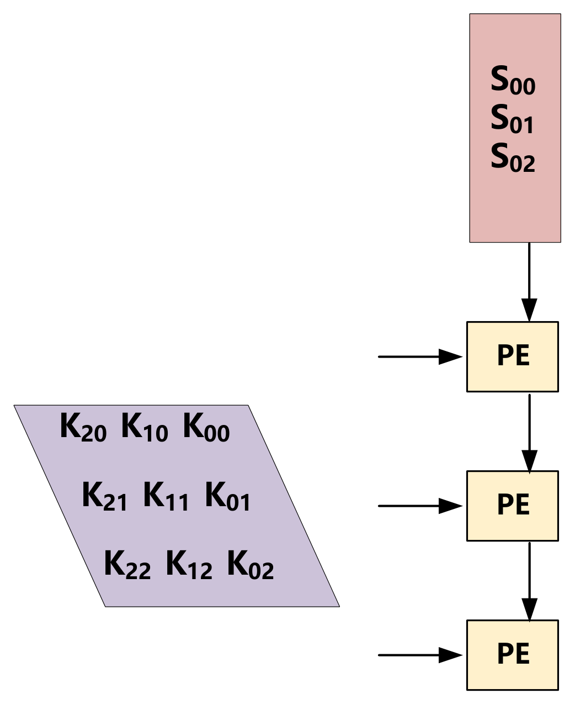
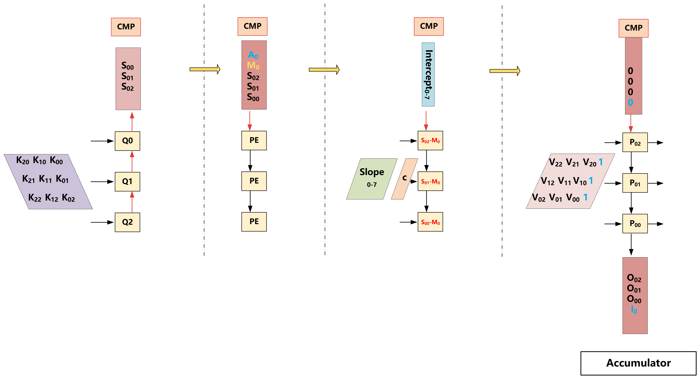
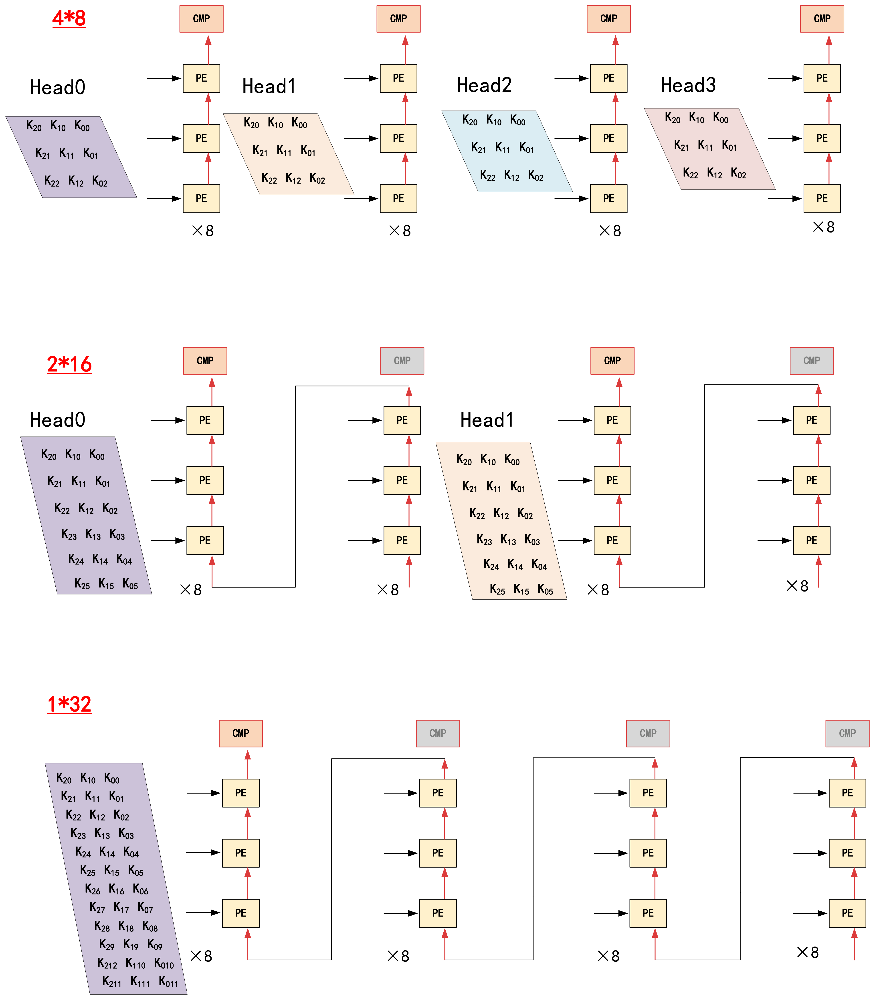
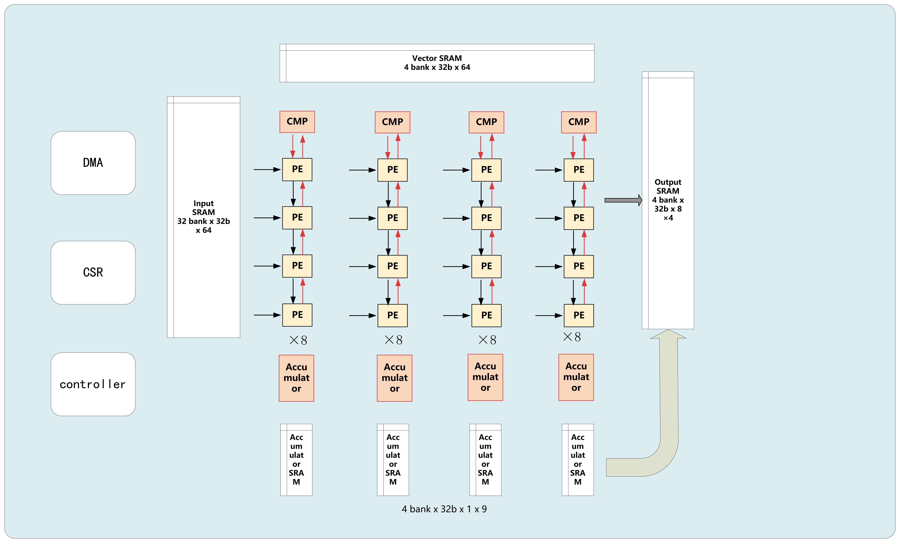
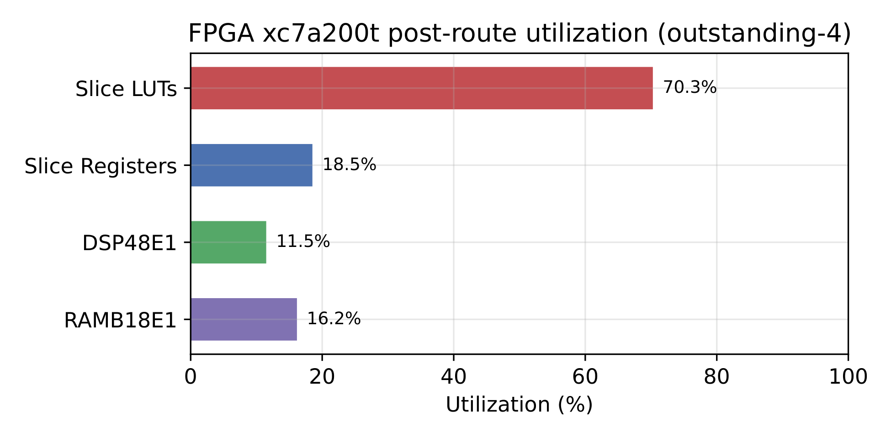

# GEMV-FSA：支持 FlashAttention 的推理加速 SoC

面向边缘端 LLM 推理的双模式脉动阵列加速器：同一套 32-PE 阵列，用输出驻留（OS）数据流加速
线性层 GEMV，用权重驻留（WS）+ FlashAttention-2 在线 softmax 加速注意力。

本仓库是 **2026 年全国大学生集成电路创新创业大赛（集创赛）龙芯中科杯总决赛**参赛作品
《支持 FlashAttention 的推理加速 SoC 设计》的前端设计部分开源发布。

| | |
|---|---|
| 赛事 | 2026 年全国大学生集成电路创新创业大赛（集创赛） |
| 赛题 | 龙芯中科杯 |
| 阶段 | 总决赛 |
| 队伍编号 | **CICC1001054** |
| 作品名称 | 支持 FlashAttention 的推理加速 SoC 设计 |

## 项目背景

本设计面向 LLaMA2 这类 decoder-only Transformer 的**自回归解码阶段**——每步只生成一个 token。
该阶段每一层内部依次要算两类算子，二者都是**访存密集（memory-bound）**、算术强度很低，
瓶颈在数据搬运而非算力。

**线性层**（Q/K/V/O 投影、FFN 的 W1/W2/W3，以及最后的 classifier）：每步只有单个 token
向量，矩阵乘退化为**矩阵-向量乘（GEMV）**——权重矩阵远大于输入向量，每个权重只参与一次
乘加就被丢弃，频繁的权重装载成为主要瓶颈。又因每层权重各不相同、算完即弃，权重驻留毫无
意义，故映射为**输出驻留（OS）**数据流：部分和在 PE 内原位累加，权重与输入向量流过阵列，
正好契合"输入向量小、权重体量大、层间切换频繁"的访存特征。



> **图 1** GEMV 的 OS 脉动数据流：部分和驻留在 PE 内原位累加，输入数据沿阵列流动并被各级 PE 复用。

**注意力**（当前 token 的 Q 与 KV cache 中的历史 K/V 做 $QK^\top$ → softmax → $PV$）：
每步同样只有一行 Q，却要把整个 KV cache 读一遍才做很少的乘加；且 softmax 的逐行全局归约
使中间结果的访存量随序列长度呈 $O(N^2)$ 增长，极易超过片上存储。这一路的设计分两步走。
**先在算法层**引入 **FlashAttention-2 的在线 softmax**：沿序列维把 K/V 分块，逐块更新行
最大值 $m$ 与归一化分母 $l$、并对已累加的输出 $O$ 做 rescale，全程不显式存储完整的注意力
矩阵，把访存复杂度降至 $O(N)$。**再由该算法的流式特性推导硬件数据流**：分数随计算逐行
流出、随即做最大值比较与指数变换，无需等整个矩阵就绪，但这要求一条"流出—变换—流回"的
通路——OS 把部分和封锁在 PE 内、末端才一次性 drain，中途取不到中间结果，只有 **权重驻留
（WS）** 天然支持。故注意力取 WS：Q 驻留在 PE 寄存器，K/V 沿阵列流入，$QK^\top$ 的累加、
softmax 的传播与 rescale、$PV$ 的累加在同一条脉动链上流水完成。



> **图 2** FSA 数据流的四个阶段：① K 流入、Q 驻留算 QKᵀ 上行累加 → ② CMP 求行最大值 M₀ →
> ③ 减最大值后经 slope/intercept 查表做 exp2 分段线性近似得到 P → ④ P 与 V 相乘下行累加出 O。

两类算子若各做一套阵列，在资源受限的边缘 FPGA 上并不划算，因此本设计让同一套 32-PE 阵列
通过可重构分组与上述双模式数据流同时覆盖二者——32 可被 8/16/32 整除，因此能无浪费地重构为
三种分组，覆盖 `head_dim` 从 8 到 64 的不同配置。



> **图 3** 可重构分组：4×8（4 头并行，每头 8 PE）/ 2×16 / 1×32。分组变大时由多段 PE 串联成更长的
> 脉动链，灰色 CMP 表示该段的比较单元在本模式下不使能。

但只做加速器还不够。竞赛平台龙芯 OpenLA500 是**单核标量、且无硬件浮点单元**的嵌入式处理器（LoongArch32，
33 MHz）：乘加只能串行执行，非线性算子（RMSNorm、RoPE、SiLU）全靠软浮点模拟，单 token 解码
需上亿周期（约 3.3 秒）——在这样的平台上，算力本身先成了约束。本项目从三个方向补齐短板：

1. **双模式脉动阵列加速 IP** —— 即上述 OS/WS 双模式阵列，可重构为 4×8 / 2×16 / 1×32
   三种分组以适配不同的单头维度（`head_dim` 8~64）；
2. **CPU 硬件浮点扩展** —— 为原本无 FPU 的 CPU 挂上 CVFPU 协处理器，消除非线性算子的
   软浮点模拟开销；
3. **SoC 总线加宽至 64 位** —— 算子卸载完成后瓶颈转移到数据搬运，把访存通路整体加宽
   一倍（详见下文）。

三者经 AXI 互联组成完整的推理加速 SoC，在 FPGA 上跑通 llama2.c + stories260K 的端到端
自回归推理。加速器顶层由 AXI 从接口与 CSR 寄存器组、AXI 主接口与 DMA 控制器、计算核心
（32 个 PE、CMP 比较单元、累加器与片上 SRAM）以及顶层作业控制器四部分组成：



> **图 4** 加速器顶层架构：CSR/DMA 调度 + 32-PE 脉动阵列 + Input/Vector/ACC/Output 四级片上 SRAM。
> CPU 通过 CSR 配置一次 job 并启动，顶层状态机驱动 DMA 搬数、触发阵列计算、再把结果写回内存，
> 全程 CPU 不介入数据搬运。

| 项目 | 内容 |
|------|------|
| 目标平台 | Xilinx Artix-7 `xc7a200tfbg676-1` |
| 工作频率 | 加速器 `sys_clk` 50 MHz / CPU `cpu_clk` 33 MHz |
| 核心架构 | 32-PE 一维脉动阵列，可重构为 4组×8 / 2组×16 / 1组×32 |
| 数据格式 | IEEE 754 FP32 |
| 接口 | AXI4 Slave（CSR，20 个寄存器） + AXI4 Master（DMA） |
| 目标模型 | llama2.c / stories260K（5 层，dim=64，8 头，vocab=512，GQA） |
| SoC 平台 | 龙芯 OpenLA500（LoongArch32）+ CVFPU + 本加速器，AXI 总线加宽至 64 位 |

## 性能与精度

端到端口径为完整 SoC 逐 token 推理耗时（覆盖 GEMV、FSA 与 CPU 调度全流程），
在 stories260K、256-token 序列上实测：

| 配置 | cycles/token | 相对纯软基线 |
|------|-------------:|-------------|
| 纯 CPU 软浮点基线 | 107,535,372 | 1× |
| + 双模式加速器（含 DMA/流水/uncached/outstanding 等优化） | 3,899,347 | **27.6×** |
| + CPU 侧 FPU、GQA、SiLU 融合、跨调用预取、64 位总线 | 511,431 | **210×** |

精度方面：

- **exp2 单算子**：8 段分段线性（PWL）近似，系数取 **Chebyshev 节点**拟合（RTL 内即为该组
  系数，见 [FPAccUnit_pipe.sv](rtl/fsa/FPAccUnit_pipe.sv)），全量扫描 32000 个 fp32 负值输入
  对照 fp64，MRE 0.0286%、最大相对误差 0.048%——已贴近同段数下 minimax 下界 0.047%。
- **端到端 FlashAttention**：以 fp64 标准 softmax 为 golden，MAE 1.17×10⁻³、MRE 0.0985%。
- **GEMV**：以 bit-exact 为目标，绝大多数输出与 fp64 参考完全一致，约 0.05% 出现 ULP 级偏差
  （FP32 并行累加顺序与串行参考不同所致）。
- **生成质量**：硬件版与纯 CPU 版在 256-token 序列上 greedy 解码**逐 token 一致**，
  next-token logit 差异仅 10⁻³ 量级，不改变 argmax。

## 存储带宽扩展：SoC 总线加宽至 64 位

两类算子卸载到加速器之后，标量 CPU 的算力约束被解除，两者本身访存密集的性质就浮上来
成为唯一的瓶颈：分段计时显示
`GEMV.hw` 占端到端时间的 33.23%，而其中按总线位宽算出的纯搬运下界又占了这一段的 87.42%；
FSA 单 tile 实测 524 拍，对比 32 位总线下的传输下界 512 拍只差 2.3%。也就是说阵列几乎
没有在等计算——继续加 PE 不会有收益，靠计算/搬运重叠隐藏延迟也已接近极限（跨调用预取实测
只拿到约 1%）。

硬件侧恰好留有余量：开发板上两片各 32 位的异步 SRAM，原本由 `addr[22]` 二选一，同一拍
总有一片的数据引脚闲置。改为两片共用低位地址、同时驱动、高低半字各出 32 位拼成 64 位后，
单次访问取回的字节数翻倍，而异步 SRAM 的 $t_{AA}$ 是器件物理属性、与一次取几个字节无关，
访问时序不变。

主要改动（均在本仓库内）：

- **互连替换**：原 SpinalHDL 生成的 2×8 crossbar 位宽在生成时写死、且仓库内无源描述，
  改用 pulp-platform 的 `axi_xbar`（位宽/端口数/ID 位宽全是参数），见
  [axi_xbar_2x8_wrap.sv](soc/rtl/ip/Bus_interconnects/axi_xbar_2x8_wrap.sv)。顺带把 DMA
  提升为正规 master（旧结构下它只能到达 4 个从设备），端口收敛为 2×5。
- **CPU 侧升宽**：`core_top` 数据总线写死 32 位且无参数，在其 AXI 口后插一级
  `axi_dw_converter` 做 32→64。它做的是*打包*而非填充，CPU 一次 16 字节 cache 行填充
  由 4 拍 32 位变成 2 拍 64 位，访存次数减半——加宽的收益不只归加速器。
- **外设直接加宽**而非降回 32 位：9 个降宽器每个约 2700 LUT，实测把整机占用推到约 97%
  已无法布通；且升宽器改写 `size` 后再降宽会把一次访问拆成两次，对 UART 接收 FIFO
  这类读敏感寄存器就是丢数据。四个外设改为 64 位前端、按 `wstrb` 选半字。
- **片上配合**：Input SRAM 改双字 entry（32 深 × 64 位）承接占 DMA 流量约 99% 的权重/KV
  主通路；Vector SRAM 把 bank 选择由地址高位改低位使相邻两字可并行写入；主存镜像按字
  交织成两份（`soc/sdk/axi_ram_base.mif` / `axi_ram_ext.mif`）。
- **返回通路 skid 寄存器**：RAM 侧 64 位而 CPU 侧 32 位，读返回需一拍拆两拍、出口速率减半，
  突发中必然背压，故在 [axi2sram_sp_ext.sv](soc/rtl/ip/Bus_interconnects/axi2sram_sp_ext.sv)
  数据通路上补一级 skid，当前拍与在途拍分开保存。

代价与收益：

| 指标 | 加宽前 | 加宽后 | 变化 |
|------|-------:|-------:|------|
| cycles/token | 589,090 | 508,319 | **−13.7%** |
| `GEMV.hw` | 195,773（33.23%） | 115,351（22.69%） | −41.1% |
| LUT 占用 | 107,301（79.72%） | 110,770（82.30%） | +3,639 LUT |

`GEMV.hw` 下降 41.1%，与"搬运时间减半"同一量级，差额来自地址通道开销与奇数列宽下的
非对齐代价。时序上四组报告零违例，setup 余量由 +0.767 ns 降至 +0.566 ns，是加宽应付的
代价。

## 验证状态

UVM 1.2 + 约束随机 + 覆盖率驱动，仿真工具 Synopsys VCS。顶层以加速器为黑盒经 AXI 驱动、
用 DPI-C 黄金模型逐输出比对；单元级对 PE、exp2、CMP、accumulator 做 ULP 级比对。

| 类别 | 结果 |
|------|------|
| UVM 测试点 | 约 590 个，功能类全 PASS（18 个 test，覆盖 directed/random/stress/错误注入/中途复位/容量边界六类） |
| 代码覆盖率 | Line 91.08% / Condition 86.57% / Toggle 95.35% / FSM 90.10% / Branch 86.18%（16 test 合并，原始值） |
| 功能覆盖率 | 95.19% |
| Directed TB | FSA E2E 三种分组模式各跑一轮（含 GQA 用例与 bit-accurate golden 对照）、GEMV tiling 定向回归 |

FSM 覆盖率距 95% 目标差约 4.9%，未覆盖的是 1~2 拍极短状态到 `S_IDLE` 的复位转移对，属结构性
不可测转移，已列入 waiver（详见 [覆盖率 waiver](uvm/docs/coverage_waivers.md)）。

## 综合成果

- **逻辑综合（DC）**：Nangate45 开源工艺库（typical，1.1 V），时钟约束 5.0 ns（200 MHz），
  OS/FSA 两种模式均时序收敛，关键路径 4.86 ns、Setup WNS/TNS 均为 0。
- **FPGA 布线后资源**（`xc7a200t`）：Slice LUTs 94,037（70.28%）、Slice Registers 49,535
  （18.51%）、DSP48E1 85 个（11.49%）、RAMB18E1 118 个（16.16%）。DSP 占用低印证了
  一维阵列换取可控资源占用的设计权衡。
- **FPGA 时序**：`sys_clk`（50 MHz）布线后 WNS ≈ +0.50 ns、TNS = 0。



> **图 5** FPGA 布线后资源利用率（outstanding-4 阶段快照）：主要消耗在 LUT，DSP 仅 11.5%。

> 说明：ASIC 后端物理实现（P&R、签核）不在本仓库开源范围内。

## 目录结构

```
gemv_fsa/
├── rtl/                        # 加速器 RTL 源代码
│   ├── CB_top_v2.sv            # 顶层模块
│   ├── cb_controll_v2.sv       # 控制器（CSR + GEMV/FSA 双模式 DMA 调度 + 预取 FSM）
│   ├── mac_top_v2.sv           # MAC 引擎顶层（PE 阵列 + FSA 数据通路）
│   ├── PE_core_v2.sv           # 32-PE 阵列（OS/WS 双模式）
│   ├── axi_dma_controller.sv   # AXI4 DMA 控制器（多笔 outstanding）
│   ├── PE/                     # PE 单元（Chisel 生成后手工重定时）
│   ├── fsa/                    # FlashAttention 专用模块
│   │   ├── fsa_ctrl_fsm.sv     # FSA 控制 FSM
│   │   ├── fsa_transposer.sv   # K 矩阵转置引擎
│   │   ├── fsa_accumulator.sv  # 在线 softmax 累加器
│   │   ├── FPAccUnit_pipe.sv   # 含 exp2 8 段 PWL（Chebyshev 系数）
│   │   └── silu_ctrl_fsm.sv    # SiLU 激活融合控制
│   └── fsa_gen/chisel_fsa_fp32/ # Chisel 生成的 FP 运算单元（CMP/比较器等）
│
├── tb/                          # Directed Testbench
│   ├── tb_fsa_e2e.sv            # FSA 端到端验证（含 GQA、bit-accurate golden）
│   ├── tb_CB_top_v2_gemv.sv     # GEMV tiling 回归
│   ├── dpi/                     # DPI-C 黄金模型（fp64 softmax + bit-accurate 转录）
│   ├── golden/                  # Python 侧 golden 生成
│   └── board_data/              # 板上抓取数据（用于回归对比）
│
├── uvm/                         # UVM 1.2 验证环境
│   ├── docs/                    # 验证报告、验证计划、环境架构、覆盖率 waiver
│   ├── agents/                  # AXI Slave Agent / DDR backdoor mem_model
│   ├── ral/                     # UVM RAL 寄存器模型
│   └── env/ sequences/ tests/ interfaces/ dpi/ top/
│
├── soc/                         # SoC 集成（集创赛龙芯杯平台）
│   ├── rtl/ip/open-la500/       # 龙芯 OpenLA500 CPU（含 cvfpu 浮点扩展，Mulan PSL v2）
│   ├── rtl/ip/gemv_accel/       # 加速器 RTL 的同步副本（见下方说明，非独立实现）
│   ├── rtl/ip/Bus_interconnects/ # AXI 互联（64 位 crossbar wrapper + SRAM 桥）
│   └── sdk/software/apps/       # llama2.c 推理固件（runc 系列）+ bsp
│
├── third_party/                 # vendored 第三方开源 RTL（pulp-platform axi / common_verification）
├── tools/                       # TB 用到的 C 侧 golden/eval 小工具
├── scripts/                     # filelist、Vivado 综合/bitgen tcl、工具链构建脚本
├── docs/spec/                   # 设计规格（FSA 编程手册、各模块设计 plan）
├── docs/figures/                # README 用架构图
├── docs/summary/                # 早期评估记录（见下方说明）
├── LICENSE                      # Apache-2.0
├── Makefile.vcs                 # VCS 本地编译/运行入口
└── README.md
```

`soc/rtl/ip/gemv_accel/` 与 `rtl/` 下的加速器源码内容相同——由 `.githooks/pre-commit` 在提交时
自动同步（安装见 `scripts/install_git_hooks.ps1`），不是两套独立实现；改动只需在 `rtl/` 下做。

> `docs/summary/` 下的两份评估报告是**早期版本的记录**：写于 exp2 换用 Chebyshev 系数、
> CPU 侧补 FPU、64 位总线等优化之前，其中的加速比（15.9×）与 exp2 精度（0.0626%）均已被
> 上文表格中的最新数据取代，保留仅作迭代过程参考。

## 快速开始

### 环境要求
- Synopsys VCS（O-2018.09+ 或 R-2020.12+）+ UVM 1.2（VCS 内置）
- 本仓库不含交叉编译工具链本体：如需构建 SoC 软件，先用
  `scripts/build_gcc_ilp32f_multilib.sh` / `scripts/build_picolibc_hwfp.sh` 在本地构建，
  产物放在 `soc/sdk/toolchains/` 下（已 gitignore）。

### Directed TB

```bash
# GEMV tiling 回归
make -f Makefile.vcs TOP=tb_CB_top_v2_gemv FILELIST=./scripts/cb_top_v2_gemv_filelist.f run_gemv_all

# FSA 端到端（依次跑 4×8 / 2×16 / 1×32 三种分组模式）
make -f Makefile.vcs TOP=tb_fsa_e2e FILELIST=./scripts/fsa_e2e_filelist.f run_fsa_all

# FSA 位级 golden 回归（对照逐条转录 RTL 的 bit-accurate golden，FAIL 必须为 0）
make -f Makefile.vcs TOP=tb_fsa_e2e FILELIST=./scripts/fsa_e2e_filelist.f run_fsa_bitacc
```

### UVM

```bash
# 单个 test
make -f Makefile.vcs run_uvm UVM_TEST=gemv_sanity_test

# 带代码覆盖率（产物在 cov_report/）
make -f Makefile.vcs run_uvm_cov UVM_TEST=fsa_soak_test
```

日常回归（11 test）：`csr_access_test` `gemv_sanity_test` `gemv_regression_test`
`silu_sanity_test` `silu_bypass_test` `pf_sanity_test` `pf_bypass_test` `fsa_sanity_test`
`fsa_regression_test` `fsa_gqa_test` `dual_mode_stress_test`

全量回归在上述基础上追加：`gemv_random_test` `gemv_random_bigrow_test`
`silu_regression_test` `silu_random_test` `pf_regression_test` `pf_random_test`
`fsa_random_test` `fsa_gqa_random_test` `error_injection_test` `mid_op_reset_test`
`precise_fsm_reset_test` `special_fp_test` `fsa_residue_impact_test` `fsa_soak_test`
`fsa_hd64_test` `fsa_hd48_test` `perf_limit_test`

逐个跑 `make -f Makefile.vcs run_uvm UVM_TEST=<name>` 即可。

### SoC / 板上 demo

`soc/README.md`、`soc/build_sw.sh` 是 llama2.c 固件的构建入口；FPGA bitstream 通过
`scripts/run_vivado_synth.tcl` + `scripts/run_soc_bitgen*.tcl`（Vivado batch 模式本地跑）生成。

## 关键设计文档

- [FSA 编程手册](docs/spec/fsa_programmer_guide.md) — CSR 寄存器、DDR 布局、配置流程
- [UVM 验证报告](uvm/docs/verification_report.md) — 完整验证结果与覆盖率
- [UVM 验证计划](uvm/docs/verification_plan.md) / [环境架构](uvm/docs/uvm_architecture.md)
- [控制 FSM 规格](docs/spec/control_fsm_spec.md)、[PE OS/WS 重构方案](docs/spec/pe_ws_os_reconfig_plan.md)

## 参考

- Dao et al., *FlashAttention: Fast and Memory-Efficient Exact Attention with IO-Awareness*, NeurIPS 2022.
- Dao, *FlashAttention-2: Faster Attention with Better Parallelism and Work Partitioning*, 2023.
- Lin et al., *SystolicAttention: Fusing FlashAttention within a Single Systolic Array*, 2025.
  （FSA 模式的脉动阵列映射思路参考自该工作；GEMV 模式的 OS 数据流为本项目独立设计）

## 许可证

本仓库以 [Apache-2.0](LICENSE) 许可发布。`third_party/`（pulp-platform axi /
common_verification）沿用其原有的 Solderpad Hardware License v0.51（基于 Apache-2.0，条款兼容），
`soc/rtl/ip/open-la500/` 沿用其原有的木兰宽松许可证第 2 版（Mulan PSL v2），
各自的 LICENSE 文件均已随目录一同保留。
